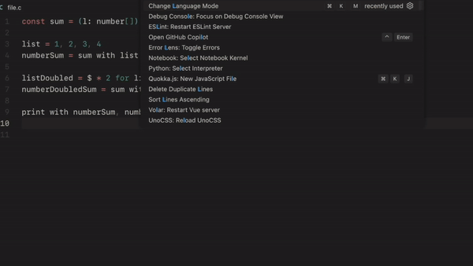

## Features

#### `generate code`
Sometimes we want to give more constraints to a code in language we already know, or write code in a language we don't, Mimic is a absolutely amazing tool for that. 

Generate code from any text or pseudocode, it mimics the rest of your code so the structure is almost always the same!

Select the text you want to generate code from, and press <kbd>Cmd+Shift+l</kbd> or <kbd>Ctrl+Shift+l</kbd> and the extension will generate code for you in the language of the current file.

#### `explain code` -- *coming soon*
Sometimes we want to understand what a piece of code does, but we don't have the time to read it. 

Mimic will explain the code for you, so you can understand it in a matter of seconds. Select the code you want to explain, and run the command `Mimic: Explain Code`.

## Requirements

You need an OpenAI API Key to use this extension. You can get one [here](https://beta.openai.com/).

## Extension Settings

* `mimic.apiKey`: Your OpenAI API Key
* `mimic.model`: The model used for the code generation. Available models are:
    * `text-davinci-003` → The best, the most expensive
        * Costs: $0.02 per 1000 tokens
    * `code-davinci-002` → Competent at code replication, but not that smart
        * Costs: $0.10 per 1000 tokens
    * `code-cushman-001` → Really fast, really dumb
        * Costs: $0.024 per 1000 tokens
    * `text-curie-001` → The cheapest, the fastest, the dumbest
        * Costs: $0.002 per 1000 tokens
* `mimic.maxTokens`: The maximum number of tokens to generate
* `mimic.generationTypingSpeed`: The typing speed of the generated code. The higher the number, the faster the code will be generated. The lower the number, the slower the code will be generated. The default value is 6.